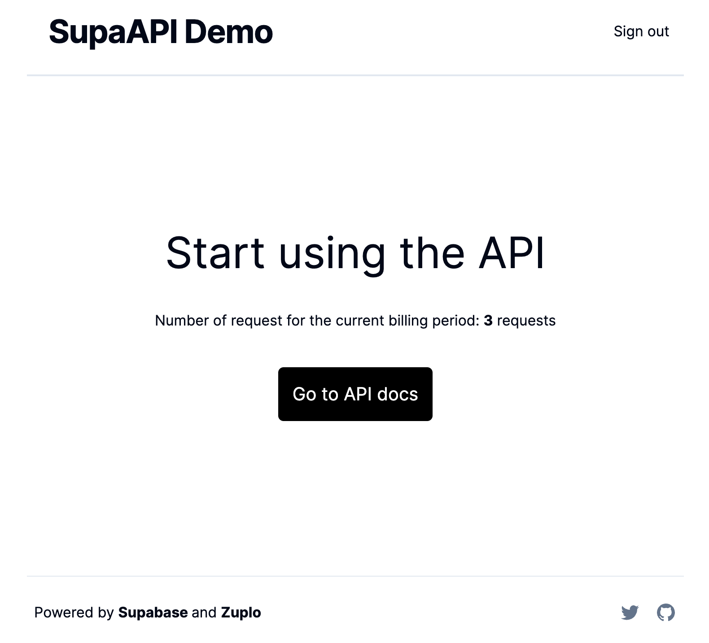

# SupaAPI: Monetizing an API with Supabase, OpenAI and Zuplo

This is a demo to help you start monetizing an API quickly using:

- [Supabase](https://supabase.com) as the database and authentication provider
- [OpenAI](https://openai.com) for spicing your API with AI
- [Zuplo](https://zuplo.com) for API auth, rate limiting, and monetization
- [Stripe](https://stripe.com) for payments and subscription management

This repo contains a dashboard that allows users to sign up, pay, and manage their subscription to any API.

## Demo 

- https://supaweek.zuplosite.com



## Getting started

### Step 1 - Create a Stripe account and product

**1. Create a Stripe account**

You'll need a Stripe account to accept payments. You can create one [here](https://dashboard.stripe.com/register).

**2. Create a metered product in Stripe**

To enable metered billing so that you can charge users for their API usage, you'll need to create a metered product in Stripe.

Go to\* **_Products_** and click **_Add a product_**.

Now create a product with the following details:


**3. Create a Pricing Table to embed on the web-app**

Go back to _Product_ menu and click on the _Pricing tables_.

Fill in the details as shown below:


**4. Add the Pricing table to the dashboard**

Copy the Pricing Table code which will be used in the web app:


Paste the code in the file [`/app/pricing/page.tsx`](./app/pricing/page.tsx)

```diff
<div
  dangerouslySetInnerHTML={{
    __html: `
+        <script async src="https://js.stripe.com/v3/pricing-table.js"></script>
+        <stripe-pricing-table pricing-table-id="prctbl_1234ABC" publishable-key="pk_test_1234ABC">
+        </stripe-pricing-table>
      `,
  }}
/>
```

> Hold on to your Stripe Secret Key
> This Key will be used in the next step to configure the Zuplo API Gateway.
> Copy the Stripe Secret Key from the top right menu **_Developers > API Keys > Copy Secret Key_**.

### Step 2 - Deploy the API with Zuplo

For the purposes of this demo, we'll be using the [SupaAPI](https://github.com/zuplo-samples/supa-api-zup) as our API which will be monetized.

It exposes one endpoint `/v1/blogs` which can either `POST` to create a new blogpost using OpenAI, or `GET` to retrieve a list of blogposts.

Click the button below to deploy the API to Zuplo:

[](http://portal.zuplo.com/zup-it?sourceRepoUrl=https://github.com/zuplo-samples/supa-api-zup)

Set the following environment variables in **_Settings > Environment Variables_**

1. `OPENAI_API_KEY`: Your OpenAPI API Key which you can get from the [OpenAI account dashboard](https://platform.openai.com/account/api-keys).

1. `STRIPE_API_KEY`: This key is the Stripe Secret Key that you got in step 1.

1. `SUPABASE_PROJECT_URL`

1. `SUPABASE_SERVICE_ROLE_KEY`

### Step 3 - Deploy to Vercel

This will deploy the dashboard to Vercel and uses the Supabase Integration to create a Supabase project and seed it with the required tables.

[](https://vercel.com/new/clone?repository-url=https%3A%2F%2Fgithub.com%2Fzuplo-samples%2Fsupa-api-dashboard&env=STRIPE_SECRET_KEY,NEXT_PUBLIC_ZUPLO_API_URL,ZUPLO_BUCKET_URL,ZUPLO_API_KEY&envDescription=To%20create%20this%20project%2C%20you%20will%20need%20a%20Supabase%20and%20Zuplo%20account%20and%20project.&project-name=supa-api-dashboard&integration-ids=oac_VqOgBHqhEoFTPzGkPd7L0iH6&external-id=https%3A%2F%2Fgithub.com%2Fzuplo-samples%2Fsupa-api-dashboard%2Ftree%2Fmain)

You will be required to add the following environment variables:

1. `STRIPE_API_KEY`: This key is the Stripe Secret Key that you got in step 1.

1. `NEXT_PUBLIC_ZUPLO_API_URL`: in Zuplo, go to the **_Settings > Project Information_** tab and copy the **_URL_**.

1. `ZUPLO_BUCKET_URL`: from the same page, copy the **_API Key Bucket URL_**.

1. `ZUPLO_API_KEY`: in Zuplo, go to the **_Settings > Zuplo API Keys_** tab and copy the available key.

### Step 4 - Try it out! 

You can now try out the dashboard following the next steps:

1. Go to the Vercel URL that was generated in the previous step.

2. Sign up for an account.

3. Subscribe to the API with [Stripe test cards](https://stripe.com/docs/testing#cards)

4. Once you're subscribed, the API dev portal link will be available in the dashboard.

5. You can now try out the API by using the `Authorization` header with the token that is available to you in the API dev portal.